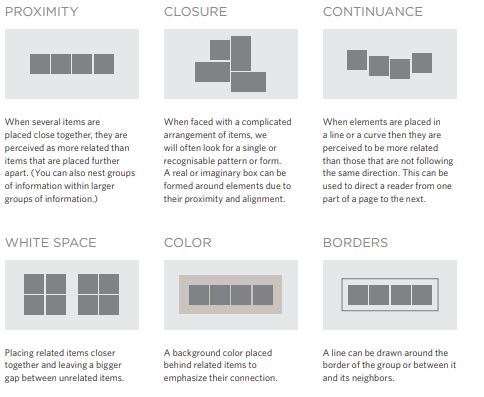
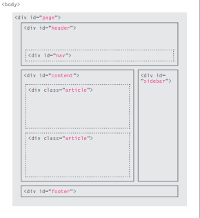
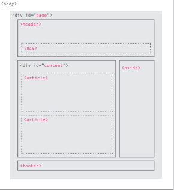
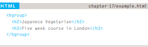

# PROCESS & DESIGN
## the process to create a new website.
 Questions to ask yourself when creationg a website.
 * ##### Who might visit your website?
 * ##### How to understand your **AUDIENCE**?
 * ##### How to Organize information so visitor can find what they are looking for?

 Design theory for presenting information in a way that helps visitors achieve their **GOALS**.
Design tips to help you create more *Attractive* & *Professional* sites.

## Who might visit your website? who is your Audience?
every website should target Audience such as **individuals** or **Companies**.
## How to understand your ***Audience***? why they are visiting your Website?
after knowing who are your audience, now you need to understand them.
your designs should be **influenced** by your visitors or users.

-----

## To help determine why people are visiting your website. there are two categories of Questions.
1. What is their **Goals** to visit your website?
1. What is the **Motivaqtion** of your Useres to visit your website?

* ### key Motivations :
1. Entertainment or Specific Goal.
1. Is the Goal personal or Professional.
1. Is spending time on this activity Essential or luxury.

* ### Goals :
1. Wanting General information / research.
1. are they familiar with your **Service** or **Product**.
1. Looking for time sensitive information.
1. Do they need to contact your.

### What my visitors try to Achieve?

it is Impossible to List every single reason why someone visits your site. But we are looking for the key tasks & motivations.

### What information my visitor need?

Now we are looking for information my visitors need to achieve theirs **Goals**.
Offer additional supporting info that you think it might be helpful.
Determine **What** they need to achieve their goals.

### How often people visit my site

a Fashion trends website needs to change more frequently than one promote services people dont buy regularly.

### Site maps
You need to use site map to show all your site main contents or categories.
### Grouping & similarity
Use sense in Design, so you can easily *Organize* your element into groups. 
### Designing Navigation
This part Deosnot only help people find where they want to go. Also helps them understand what your site is about.

# HTML Layout
* **(< div >)** element is used to group related elemetns on the page. as shown in the below image.
 

 # HTML 5 
 introduce a new set of **elements** that allow you to divide up the parts of a page. the name of these elements indicate the kind of content that shown in them.

 # Headers & Footers 
 the main **Header** or **Footer** that appears at the top or the bottom of every page on the site.
 the **header** tag is
* (< header >) (< / header >)
* ( < footer >) ( < / footer > )

# navigation < nav >

is used to contain the major navigational blocks on the site.

# articles < article >
this could be an individual article or blog entry. each article needs it own article tags.

# Asides < aside >
this tag has two purposes it depends on inside of what it is.
when its **inside** an < article > it should contain information about the article.
when its **outside** the < article > it acts as container for content that is related to the entire page.

# sections < section >
groups related content together.

# heading groups < hgroup > 
is used to group together a set of one or more < h1 > through < h6 > elements so they are treated as one heading.

# figures < figure > < figcaption >
it can be used to contain any content that is referenced from an article.

< figcaption > add a caption to the figure.

----------------------------------

# The Evolution of HTML
* ## HTML 4
had some **presentational** elements to
control the appearance of pages,
authors are not recommended to
use them any more.
* ## XHTML 1.0 
Since HTML was the most widely used
markup language around, it was
decided that **HTML 4** should be
reformulated to follow the rules
of *XML* and it was renamed
***XHTML***. This meant that
authors had to follow some new,
more strict rules about writing
markup. For example:
* Every element needed a
closing tag (except for empty
elements such as ).
* Attribute names had to be in
lowercase.
* All attributes required a value,
and all values were to be
placed in double quotes.
* Deprecated elements should
no longer be used.
* Every element that was
opened inside another
element should be closed
inside that same element.

* ## HTML5
Web page authors do
not need to close all tags, and
new elements and attributes will
be introduced. At the time of
writing, the HTML5 specification
had not been completed.

------

# DOCTYPEs
Each web page should begin with a
**DOCTYPE** declaration to tell a
browser which version of *HTML*
the page is using.

# Comments in HTML
 < !-- --> 
 If you want to add a **comment**
to your code that will not be
visible in the user's browser, you
can add the text between these
characters.

# ID Attribute 
Every **HTML** element can carry
the ***id attribute***. It is used to
uniquely identify that element
from other elements on the
page.
# Class Attribute
Every **HTML** element can
also carry a ***class attribute***.
Sometimes, rather than uniquely
identifying one element within
a document, you will want a
way to identify several elements
as being different from the
other elements on the page. 
# Block Elements
Some elements will always
appear to start on a new line in
the browser window. These are
known as ***block level*** elements. 
# Inline Elements
Some elements will always
appear to continue on the
same line as their neighbouring
elements. These are known as
***inline*** elements.
# Grouping Text &Elements In a Block
The < div> element allows you to
group a set of elements together
in one block-level box.
# Grouping Text &Elements Inline 
The < span> element acts like
an inline equivalent of the < div>
element. It is used to either:
1. Contain a section of text
where there is no other suitable
element to differentiate it from
its surrounding text.
2. Contain a number of inline
elements.
# IFrames
An **iframe** is like a little window
that has been cut into your
page — and in that window you
can see another page. The term
**iframe** is an abbreviation of ***inline frame***

# Information About Your Pages
< meta>
The < meta> element lives
inside the < head> element and
contains information about that
web page.
It is not visible to users but
fulfills a number of purposes
such as telling search engines
about your page.