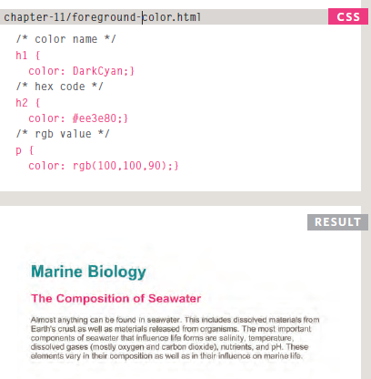
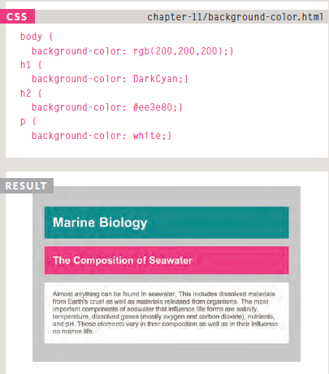
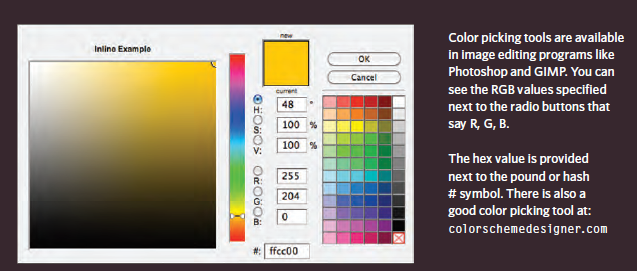
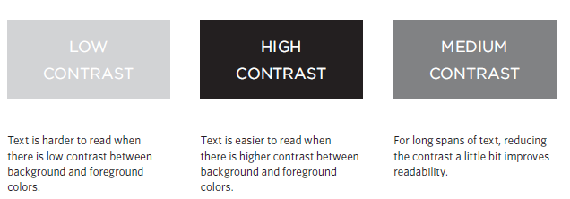

# COLOR
Color can really bring your pages to life.
## Foreground Color
---
* The **color** property allows you
to specify the color of text inside
an element.

* you can select a color in three ways:

     * rgb values
     * hex codes
     * color names
     

# Background Color
*CSS* treats each *HTML* element
as if it appears in a **box**, and the
background-color property
sets the color of the background
for that box.

# Understanding Color
Every color on a computer screen is created by mixing amounts of red,green, and blue.

To find the color you want, you can use a color picker.

# Contrast 

When picking **foreground* and *background*
colors, it is important to ensure that there is
enough **contrast** for the text to be legible.

# CSS 3: Opacity
## Opacity, rgba

**CSS3** introduces the *opacity*
property which allows you to
specify the opacity of an element
and any of its child elements.

The value is a number between
0.0 and 1.0 (so a value of 0.5
is 50% opacity and 0.15 is 15%
opacity).

The **CSS3** *rgba* property allows
you to specify a color, just like
you would with an RGB value,
but adds a fourth value to
indicate opacity.

## HSL COLOR
**Hue** is the colloquial idea of
color. In HSL colors, hue is often
represented as a color circle
where the angle represents the
color, although it may also be
shown as a slider with values
from 0 to 360.

**Saturation** is the amount of
gray in a color. Saturation is
represented as a percentage.
100% is full saturation and 0%
is a shade of gray.

**lightness** is the amount of
white (lightness) or black
(darkness) in a color. Lightness
is represented as a percentage.
0% lightness is black, 100%
lightness is white, and 50%
lightness is normal. Lightness
is sometimes referred to as
***luminosity***.

## HSL and HSLA
**Hue** This is expressed as an angle
(between 0 and 360 degrees).

**Saturation** This is expressed as a
percentage.

**lightness** This is expressed as a
percentage with 0% being white,
50% being normal, and 100%
being black.

**alpha** This is expressed as a
number between 0 and 1.0.
For example, 0.5 represents
50% transparency, and 0.75
represents 75% transparency.