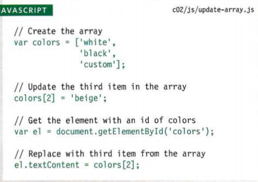

# How java script makes web pages more interactive
Java script allows you to make webpages more interactive by accesing and modifying the content and markup used in a webpage while it's being viewed in the browser.
* access content 
You can use java script to select any element atribute or text from an HTML page. 

* modify content
You can use java script to add elements attribute and text to the page or remove them 

* program rules
You can specify a set of sets for the browser to follow which allows it to acess or change the content of the page 

* react to events
You can specify that a script should run when a specefic event has occured 

* what's a script and how do I create one?
A script is a series of instructions that a computer can follow to achieve goals. 

* to write a script you need to state your goal then list the tasks that need to be completed in order to achieve it: 

   * first start with a big picture of what you want to achieve then break it down into smaller steps

      * define the goal.

       * design the script.

       * code each step
  * to *design* a script draw a flow chart to represent your content then organize in a list. 

# rules for naming variables 
1- The name must begin with a letter, dollar sign, or underscore.

2- the name can contain letters, numbers, and dollar signs or an underscore.

3- you can't use keywords or reserved words.

4- all variables are case sensitive.

5- use a name that desrcibes the kind of information that the variable stores.

6- if your variable name is made up of more than one word use capital letters for the first letter of each word. 

# arrays:
An array is a special type of variable it doesn't just store one value it stores a list of values. 

* Values in arrays:
Values in an array can be accesed as if they are in a numbered list, the numbering of the list starts at zero. 

* accessing and changing values in an array:

# expressions
An expression evaluates into a single value
1- expressions that just assign a value to a variable (var color= "pink").

2- expression that use two or more values to return a single value (var area= 3*2).

# functions, methods, and objects: 

* functions and methods:
Functions consist of a series of statements that have been grouped together because they perform a specefic task. 

* objects:
Used to create models of the world using data and that objects are made up of properties and methods. 

* built-in objects:
The browser comes with a set of objects that act like a tool kit for creating interactive web pages.