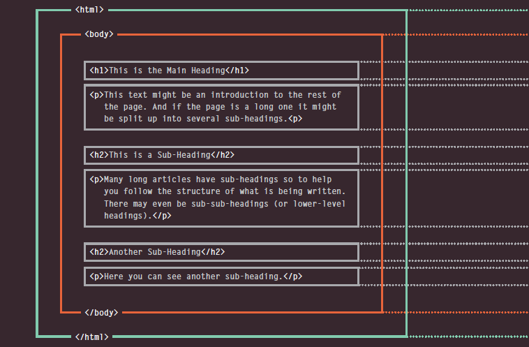

# How the web works

when visiting a **websit**, the **web server** hosting that site could be anywhere in the world. Before finding  the web server the browser will first connect to a *Domain Nme System* server.

## To understand how it work here is more info about it:
* When connecting to web you di it via an internet service provider such as **GOOGLE.COM**

* Your computer contact a network of servers called *DNS* as we mentioned before. this DNS give each computer an IP address and it is unique.

* That unique number returns to your computer allows your browser to contact the web server .

* Then the server sends the page you requested.

# HTML uses elements to describe the structure of pages

A look closer at the code 

Tags act like containers, they tell about information that lies inside it.

# Escape characters 

there are some characters that are used in HTML & are reserved 

----------------

# Java

## Designing a script :

* Tasks:
when you know the goal of your script you can work out the individual *tasks* needed to be achieved.
* Steps: each task may be broken into a series of steps when coding each step can be a line of *code*.

## How a browser sees a WebPage
1. Recieving a page as HTML
1. Create a model of the page and store it in memory.
1. Use a rendering engine to show the page on screen.

All browsers use *JAVASCRIPT* interpreter to traslate your instructions.

## How to use Objects and Methods

this is calling.

## JavaScript runs where it found in the HTML 

When the browser runs a code and come across a **< script>** element, it stops to load the script and checks to see if it needs to do anything.

The 

    . JS file is for JAVASCRIPT

    .CSS  for styling
     
    .HTML for HTML pages