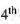
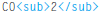
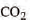
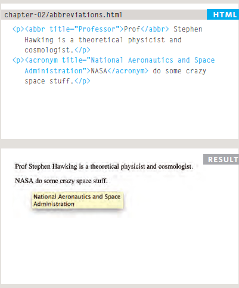
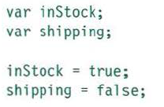
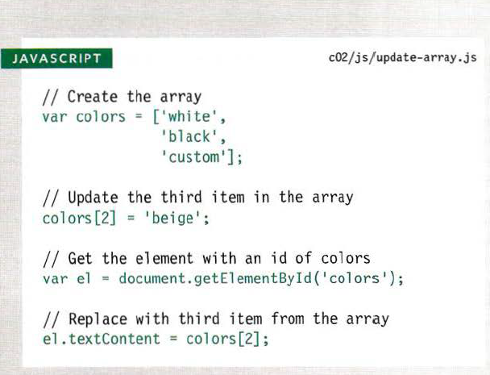
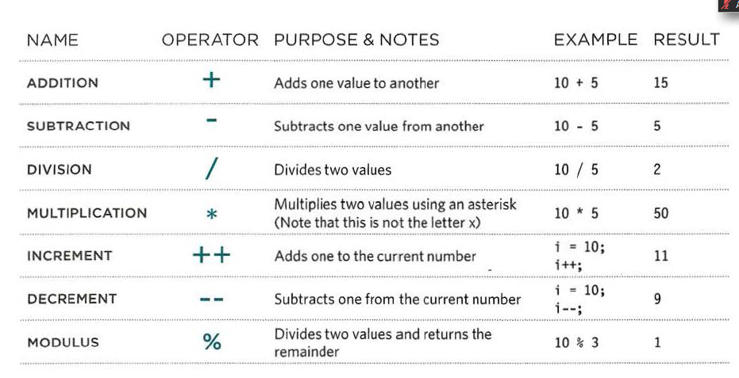
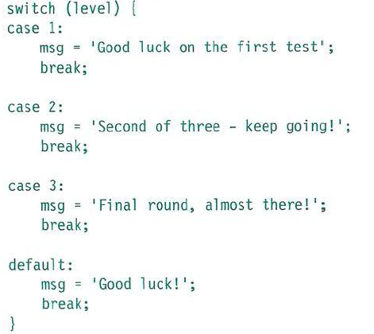

# TEXT
when creating a webpage, we add tags or Markup to the content of the page. These tags provide meaning & allow browsers to show users the appropriate structure for the page.

## There is two types of markup

* Structural markup : for Heading and Paragraphs
* Semantic markup : provides extra information, such as where empasis is placed in a sentence.

## HTML has six "levels " of heading h1 to h6

* h1 is the main heading.
* h2 is the subheading.
* h3 is used if there is any sections under the subheading.
 h1 is the largest and h6 is the smallest.

 ## Paragraphs
 To create a normal paragraph we just sorround it with the < p>< /p > tags.

 ## Bold & Italic
 < b> tag is used to make the character bold.

 < i> it make the character italic.

 ## Superscript & Subscript

 < sup> it make the character superscript 

 

 the result is like the image below:

 

 < sub> it used to make the character subscript 

 
 
 the result will look like:

 
 ## Whitespace
 In order to make code easier to read, webpage Author often add extra spaces between elements. so when the browser comes across two or more spaces next to each other it only display one space.

 ## Line breaks & Horizontal Rules

 * < br/> when using it in the end of a word it will make a new line to start the rest of the words.

 *< hr/> it is used to create breaks between themes such as when starting a new topic.

 ## Visual Editors & their code views

 * Visual editors 
often resemble word processors. although each editor will differ slightly.

* Code views
show you the code created by the visual editor so you can manually edit it.
---- 

# Semantic markup
There are some text elements that are not included to affect the structure of the webpage, but they add extra information to the pages.

## Strong & Emphasis

* < strong> it makes the character **bold**.

* < em> it makes the character *italic*

## Quotation 
* < blockquote> is used for longer quotes that take an entire paragraph.

* < q> is used for shorter quotes that sit within a paragraph.

## Abbreviation & accronyms

< abbr> if you used an abbreviation or an accronyms then the < abbr> can be used

## Citation & difinitions
* < cite> when you are referincing a piece of work such as a book, this tag is used to indicate where the citation is from.
 
* < dfn> is used to indicate the defining instance of a newterm.

## Author Details

< address> element has
quite a specific use: to contain
contact details for the author of
the page.

## Changes to Content

* < ins> is used
to show content that has been
inserted into a document.
* < del> is used to show text
that has been deleted from it.

* < s> indicates
something that is no longer
accurate.

----

# Understanding CSS:
## Thinking Inside the Box

The key to understanding how *CSS* works is to imagine that there is an invisible box around every *HTML* element.

 CSS allows you to create rules that control the way that each individual box (and the contents of that box) is presented.

 CSS Associates Style rules with HTML
elements: These rules govern
how the content of specified elements should be displayed.

 A CSS rule
contains two parts: a **selector** and a **declaration**.
* Selector: indicate which
element the rule applies to.
 
 * Declaration: indicate how
the elements referred to in the selector should be styled.

CSS Properties Affect How Elements Are
Displayed 

CSS declarations sit inside curly brackets and each is made up of two
parts: a **property** and a **value**, separated by a *colon*.

* **Properties** indicate the aspects
of the element you want to
change. For example, color, font,
width, height and border.
* **Values** specify the settings
you want to use for the chosen
properties.

## Using External CSS

< link href="css/styles.css" type="text/css"
rel="stylesheet" />

## Using Internal CSS 

< style type="text/css">

body {

font-family: arial;

background-color: rgb(185,179,175);}

h1 {

color: rgb(255,255,255);}

< /style>

## CSS Selectors

Selector| Meaning| Example
-------------|---------|-------
Universal Selector | Applies to all elements in the document  | * {}Targets all elements on the page
Type Selector  |Matches element names| h1, h2, h3 {}Targets the < h1>, < h2> and < h3>elements
Class Selector| Matches an element whose class attribute|.note {} Targets any element whose class attribute has a value of note p.note {} Targets only < p> elements whose class attribute has a value of note
ID Selector | Matches an element whose id attribute has a value that matches the one specified after the pound or hash symbol | #introduction {} Targets the element whose id attribute has a value of introduction
Child Selector| Matches an element that is a direct child of another| li>a {} Targets any < a> elements that are children of an < li> element (but not other < a> elements in the page)
Descendant Selector | Matches an element that is a descendent of another specified element| p a {}Targets any < a> elements that sit inside a < p> element, even if there are other elements nested between them
Adjacent Sibling Selector| Matches an element that is the next sibling of another | h1+p {}Targets the first < p> element after any < h1> element
General Sibling| Matches an element that is a sibling of another, although it does not have to be the directly preceding element Selector | h1~p {} If you had two  < p> elements that are siblings of an < h1> element, this rule would apply to both

----

# Java
* STATEMENTS
A script is a series of instructions that a computer can follow one-by-one.
* COMMENTS to explain what your code does.

## WHAT IS A VARIABLE?
A script will have to temporarily
store the bits of information it
needs to do its job.
## DATA TYPES 
* NUMERIC DATA TYPE
The numeric data type handles
numbers.
* STRING DATA TYPE
consists of
letters and other characters.
* BOOLEAN DATA TYPE
can have one
of two values: true or false

## CHANGING THE VALUE OF A VARIABLE
Once you have assigned a value
to a variable, you can then
change what is stored in the
variable later in the same script.

## RULES FOR NAMING VARIABLES
* The name must begin with
a letter, dollar sign ($),or an
underscore (_). It must not start
with a number.
* The name can contain letters,
numbers, dollar sign ($), or an
underscore (_). Note that you
must not use a dash(-) or a
period (.) in a variable name. 
* You cannot use keywords or
reserved words.
* All variables are case sensitive,
so score and Score would be
different variable names.
* Use a name that describes the
kind of information that the
variable stores.
* If your variable name is made
up of more than one word, use a
capital letter for the first letter of
every word after the first word.

## ARRAYS
An **array** is a special type of variable. It doesn't
just store one value; it stores a list of values.
## CREATING AN ARRAY
You create an array and give it
a name just like you would any
other variable (using the var
keyword followed by the name of
the array).
## VALUES IN ARRAYS
Values in an array are accessed as if they are in
a numbered list.
## ACCESSING & CHANGING VALUES IN AN ARRAY

## EXPRESSIONS
An expression evaluates into (results in) a single value.
Types of Expressions:

* EXPRESSIONS THAT JUST ASSIGN A
VALUE TO A VARIABLE: 
In order for a variable to be useful, it needs to be
given a value. As you have seen, this is done using
the assignment operator (the equals sign).
var color = 'beige';
* EXPRESSIONS THAT USE TWO OR
MORE VALUES TO RETURN A
SINGLE VALUE: 
You can perform operations on any number of
individual values (see next page) to determine a
single value. For example:
var area = 3 * 2;

## OPERATORS
Expressions rely on things called operators; they allow programmers to
create a single value from one or more values.

## ARITHMETIC OPERATORS
(+,-,/,*,++,--,%)

------
# Switch

A switch statement starts with a
variable called the switch value.
Each case indicates a possible
value for this variable and the
code that should run if the
variable matches that value.

