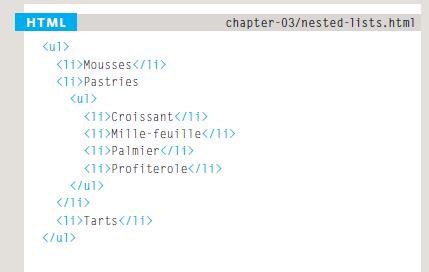
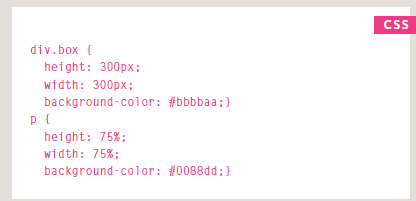
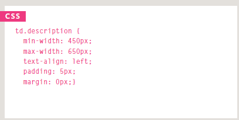
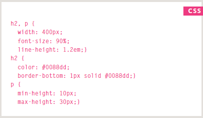
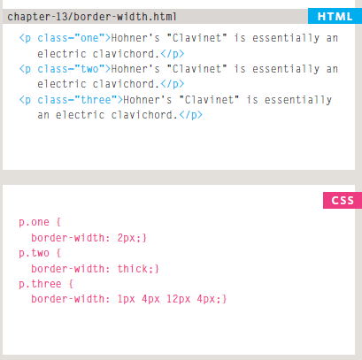
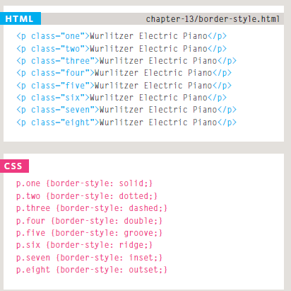
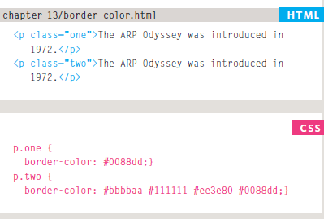
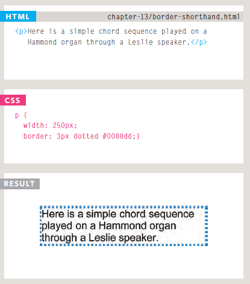
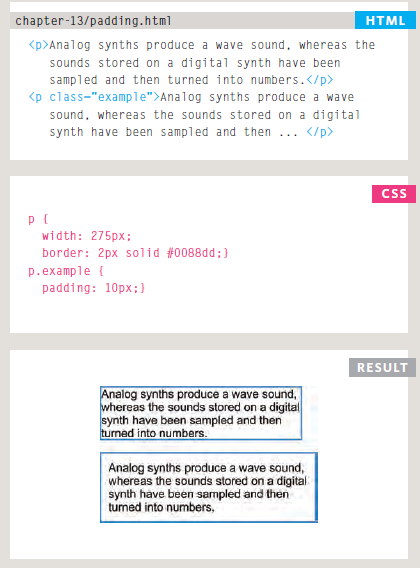
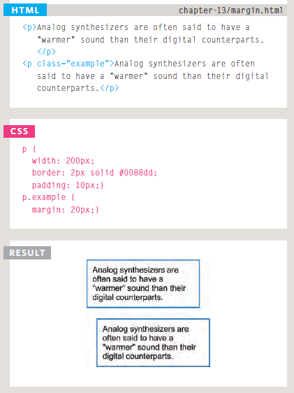

# LISTS

There are lots of occasions when we
need to use lists.

 HTML provides us with
three different types:

* **Ordered lists** are lists where each item in the list isnumbered.
* For example, the list might be a set of steps for a recipe that must be performed in order, or a legal contract
   where each point needs to be identified by a section number.
* **Unordered lists** are lists that begin with a bullet point(rather than characters that indicate order).
* **Definition lists** are made up of a set of terms along with the
definitions for each of those terms.

## ORDERED LIST

< ol>
The ordered list is created with
the < ol> element.
< li>
Each item in the list is placed
between an opening < li> tag
and a closing < /li> tag. (The li
stands for list item.)

## UNORDERED LIST

< ul>
The unordered list is created
with the < ul> element.
< li>
Each item in the list is placed
between an opening < li> tag
and a closing < /li> tag. (The li
stands for list item.)

## DIFINITION LIST

* < dl>
The definition list is created with
the < dl> element and usually
consists of a series of terms and
their definitions.
Inside the < dl> element you will
usually see pairs of < dt> and
< dd> elements.
* < dt>
This is used to contain the term
being defined (the definition
term).
* < dd>
This is used to contain the
definition.

## Nested Lists
You can put a second list inside
an < li> element to create a sublist
or nested list.

# BOXES

You can set several properties that affect the appearance of these boxes.
you will see how to:

* Control the dimensions of your boxes
* Create borders around boxes
* Set margins and padding for boxes
* Show and hide boxes

## Box Dimensions

### width, height

By default a box is sized just big
enough to hold its contents. To
set your own dimensions for a
box you can use the height and
width properties.

## Limiting Width

### min-width, max-width
These are very helpful properties
to ensure that the content of
pages are legible (especially on
the smaller screens of handheld
devices).

## Limiting Height

### min-height, max-height

In the same way that you might
want to limit the width of a box
on a page, you may also want
to limit the height of it. This is
achieved using the min-height
and max-height properties.

## Overflowing Content

The **overflow** property tells the
browser what to do if the content
contained within a box is larger
than the box itself. It can have
one of two values:
**hidden**
This property simply hides any
extra content that does not fit in
the box.
**scroll**
This property adds a scrollbar to
the box so that users can scroll
to see the missing content.

## Border, Margin& Padding

1. **Border**
Every box has a border (even if
it is not visible or is specified to
be 0 pixels wide). The border
separates the edge of one box
from another.

1. **Margin**
Margins sit outside the edge
of the border. You can set the
width of a margin to create a
gap between the borders of two
adjacent boxes.

1. **Padding**
Padding is the space between
the border of a box and any
content contained within it.
Adding padding can increase the
readability of its contents.

## Border Width

The value of this
property can either be given
in pixels or using one of the
following values:

* thin
* medium
* thick

You can control the individual
size of borders using four
separate properties:

* border-top-width
* border-right-width
* border-bottom-width
* border-left-width

## Border Style

* **solid** a single solid line
* **dotted** a series of square dots
(if your border is 2px wide, then
the dots are 2px squared with a
2px gap between each dot)
* **dashed** a series of short lines
* **double** two solid lines (the
value of the border-width
property creates the sum of the
two lines)
* **groove** appears to be carved
into the page
* **ridge** appears to stick out from
the page
* **inset** appears embedded into
the page
* **outset** looks like it is coming
out of the screen
* **hidden / none** no border is
shown
You can individually change the
styles of different borders using:

border-top-style

border-left-style

border-right-style

border-bottom-style

## Border Color

It is possible to individually
control the colors of the borders
on different sides of a box using:

border-top-color

border-right-color

border-bottom-color

border-left-color

## Shorthand border

The border property allows you
to specify the width, style and
color of a border in one property
(and the values should be coded
in that specific order).

## PADDING

The padding property allows
you to specify how much space
should appear between the
content of an element and its
border.
You can specify different values
for each side of a box using:

padding-top

padding-right

padding-bottom

padding-left

## MARGIN

The margin property controls
the gap between boxes. Its value
is commonly given in pixels,
although you may also use
percentages or ems.

You can specify values for each
side of a box using:

margin-top

margin-right

margin-bottom

margin-left

# ARRAYS

* **Why** we use ARRAYS?
* **What** Are the ARRAYS?
* **How** we use the ARRAYS?

## Why we use ARRAYS?

You should consider using an
*Array* whenever you are working
with a list or a set of values that
are related to each other.

## What are the ARRAYS?

An *Array* is a special type of variable. It doesn't just store one value; it stores a list of values.

## How we use the ARRAYS?

For example, an *Array* can be
suited to storing the individual
items on a shopping list because
it is a list of related items.
Additionally, each time you write
a new shopping list, the number
of items on it may differ.

## CREATING AN ARRAY

You create an array and give it
a name just like you would any
other variable (using the var
keyword followed by the name of
the array).

>The values are assigned to the
array inside a pair of square
brackets, and each value is
separated by a comma. The
values in the array do not need
to be the same data type, so you
can store a string, a number and
a Boolean all in the same array.

## VALUES IN ARRAYS

Values in an array are accessed as if they are in
a numbered list. It is important to know that the
numbering of this list starts at **zero (not one)**.

## ACCESSING & CHANGING VALUES IN AN ARRAY

>The first lines of code on the left
create an array containing a list
of three colors.

>Having created the array, the
third item on the list is changed
from 'custom' to 'beige'.

>To access a value from an array,
after the array name you specify
the index number for that value
inside square brackets.

>In the last two statements, the
newly updated third item in the
array is added to the page.

# IF...ELSE STATEMENTS

The IF...ELSE statement check if the condition return *true*. then the first code block will be executed.
if *false* the second code block will be executed.

# Switch

A switch statement starts with a
variable called the switch value.
Each case indicates a possible
value for this variable and the
code that should run if the
variable matches that value.

# TYPE COERCION & WEAK TYPING

If you use a *data type* JavaScript did not expect,
it tries to make sense of the operation rather
than report an error.

------
DATA TYPE| PURPOSE
-------|-------
string| Text
number| Number
Boolean| true or false
null| Empty value
undefined| Variable has been declared but not yet assigned a value
------

>JavaScript is said to use weak
typing because the data type
for a value can change. Some
other languages require that you
specify what data type
each variable will be. They are
said to use strong typing.

# TRUTHY & FALSY VALUES

* Falsy values are treated as if they
are false.
* Truthy values are treated as if
they are true.

**FALSY VALUES**
------
VALUE|DESCRIPTION
------|------
var highScore = false;|The traditional Boolean false
var highScore = 0;| The number zero
var highScore = ' ';|NaN not a number
var highScore = 10/'score' ;| Empty value
var highScore;| A variable with no value assigned to it

**TRUTHY VALUES**
----
VALUE| DESCRIPTION
-----|--------
var hi ghScore = true ;| The traditional Boolean true
var highScore = l;| Numbers other than zero
var highScore = 'carr ot ' ;| Strings with content
var highScore = 10/5;| Number ca lculations
var highScore = 'true';| true written as a string
var highScore = ' O' ;| Zero written as a string
var highScore = ' false';| false written as a string
