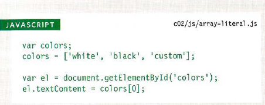
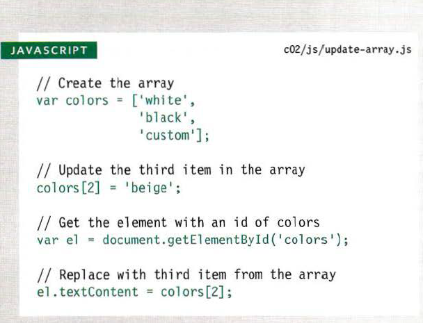
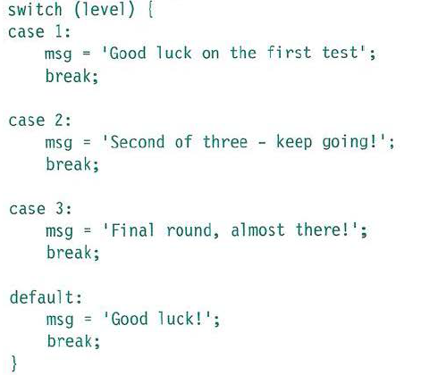

# ARRAYS

* **Why** we use ARRAYS?
* **What** Are the ARRAYS?
* **How** we use the ARRAYS?

## Why we use ARRAYS?

You should consider using an
*Array* whenever you are working
with a list or a set of values that
are related to each other.

## What are the ARRAYS?

An *Array* is a special type of variable. It doesn't just store one value; it stores a list of values.

## How we use the ARRAYS?

For example, an *Array* can be
suited to storing the individual
items on a shopping list because
it is a list of related items.
Additionally, each time you write
a new shopping list, the number
of items on it may differ.

## CREATING AN ARRAY

You create an array and give it
a name just like you would any
other variable (using the var
keyword followed by the name of
the array).

>The values are assigned to the
array inside a pair of square
brackets, and each value is
separated by a comma. The
values in the array do not need
to be the same data type, so you
can store a string, a number and
a Boolean all in the same array.

## VALUES IN ARRAYS

Values in an array are accessed as if they are in
a numbered list. It is important to know that the
numbering of this list starts at **zero (not one)**.

## ACCESSING & CHANGING VALUES IN AN ARRAY

>The first lines of code on the left
create an array containing a list
of three colors.

>Having created the array, the
third item on the list is changed
from 'custom' to 'beige'.

>To access a value from an array,
after the array name you specify
the index number for that value
inside square brackets.

>In the last two statements, the
newly updated third item in the
array is added to the page.

# IF...ELSE STATEMENTS

The IF...ELSE statement check if the condition return *true*. then the first code block will be executed.
if *false* the second code block will be executed.

# Switch

A switch statement starts with a
variable called the switch value.
Each case indicates a possible
value for this variable and the
code that should run if the
variable matches that value.

# TYPE COERCION & WEAK TYPING

If you use a *data type* JavaScript did not expect,
it tries to make sense of the operation rather
than report an error.

------
DATA TYPE| PURPOSE
-------|-------
string| Text
number| Number
Boolean| true or false
null| Empty value
undefined| Variable has been declared but not yet assigned a value
------

>JavaScript is said to use weak
typing because the data type
for a value can change. Some
other languages require that you
specify what data type
each variable will be. They are
said to use strong typing.

# TRUTHY & FALSY VALUES

* Falsy values are treated as if they
are false.
* Truthy values are treated as if
they are true.

**FALSY VALUES**
------
VALUE|DESCRIPTION
------|------
var highScore = false;|The traditional Boolean false
var highScore = 0;| The number zero
var highScore = ' ';|NaN not a number
var highScore = 10/'score' ;| Empty value
var highScore;| A variable with no value assigned to it

**TRUTHY VALUES**
----
VALUE| DESCRIPTION
-----|--------
var hi ghScore = true ;| The traditional Boolean true
var highScore = l;| Numbers other than zero
var highScore = 'carr ot ' ;| Strings with content
var highScore = 10/5;| Number ca lculations
var highScore = 'true';| true written as a string
var highScore = ' O' ;| Zero written as a string
var highScore = ' false';| false written as a string
