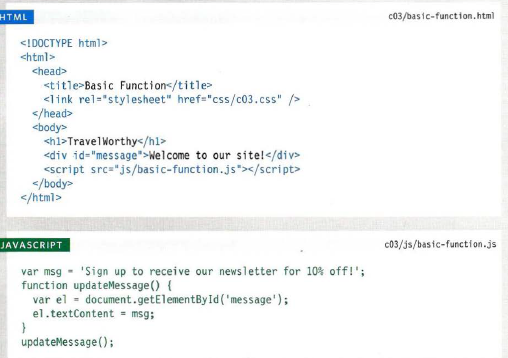
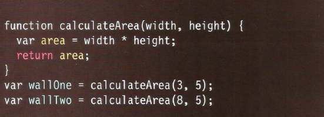

# Writing Links

**Links** are created using the < a> element. Users can click on anything between the opening < a> tag and the closing < /a> tag. You specify which page you want to link to using the href attribute.

## Linking to Other Sites

< a> other-sites.html HTML
Links are created using the < a>
element which has an attribute
called href. The value of the
href attribute is the page that
you want people to go to when
they click on the link.

## Linking to other page in the same site

< a>
When you are linking to other
pages within the same site,
you do not need to specify the
domain name in the URL. You
can use a shorthand known as a
relative URL.

# Directory Structure

On larger websites it's a good idea to organize your code by placing the
pages for each different section of the site into a new folder. Folders on a
website are sometimes referred to as directories.

## Structure

The diagram on the right shows the directory structure for a fictional entertainment listings website called ExampleArts.The top-level folder is known as the root folder.

## Relationships

The relationship between files and folders on a website is described using the same terminology as a family tree.

## Homepages

The main homepage of a site written in HTML (and the homepages of each section in a child folder) is called index.html.

## Relative URLs

Relative URLs can be used when linking to pages within your own
website. They provide a shorthand way of telling the browser where to
find your files.

------

Relative Link Type | example
-------------|--------
*Same Folder* To link to a file in the same folder, just use the file name. (Nothing else is needed ) | To link to music reviews from the music homepage:< a href="reviews.html">Reviews< /a>
*Child* Folder For a child folder, use the name of the child folder, followed by a forward slash, then the file name.| To link to music listings from the homepage:< a href="music/listings.html">Listings< /a>
*Grandchild Folder*Use the name of the child folder, followed by a
forward slash, then the name of the grandchild folder, followed by another forward slash, then the file name.| To link to DVD reviews from the homepage:< a href="movies/dvd/reviews.html">Reviews< /a>
*Parent Folder*Use ../ to indicate the folder above the current one,then follow it with the file name.| To link to the homepage from the music reviews:< a href="../index.html">Home< /a>
*GrandParent Folder*Repeat the ../ to indicate that you want to go up two folders (rather than one), then follow it with the file name.| To link to the homepage from the DVD reviews:< a href="../../index.html">Home< /a>

# Email Links

mailto:
To create a link that starts up the user's email program and addresses an email to a specified email address, you use the < a> element. However, this time the value of the href attribute starts with mailto: and is followed by the email address you want the email to be sent to.

## Opening Links in a New Window

**target**
If you want a link to open in a new window, you can use the target attribute on the opening < a> tag. The value of this attribute should be _blank.

# Key Concepts in Positioning Elements

Building Blocks CSS treats each HTML element as if it is in its own box. This box will either be a block-level box or an inline box.

* *Block-level elements*
start on a new line
Examples include:
< h1> < p> < ul> < li>.

* *Inline elements*
flow in between
surrounding text
Examples include:
< img> < b> < i>.

# Controlling the Position of Elements

* *Normal flow*
Every block-level element appears on a new line, causing each item to appear lower down the page than the previous one. Even if you specify the width of the boxes and there is space for two elements to sit side-byside, they will not appear next to each other. This is the default
behavior (unless you tell the browser to do something else).

* *Relative Positioning*
This moves an element from the position it would be in normal flow, shifting it to the top,right,
bottom, or left of where it would have been placed. This does not affect the position of surrounding elements; they stay in the position they would be in normal flow.

## To indicate where a box should be positioned

* *Fixed Positioning*
This is a form of absolute positioning that positions the element in relation to the browser window, as opposed to the containing element.
* *Floating Elements*
Floating an element allows you to take that element out of normal flow and position it to the far left or right of a containing box.

-----------

# FUNCTIONS & OBJECTS BUILT-IN & METHODS OBJECTS

## Functions

Functions consist of a series of statements that have been grouped to together because they perform a specific task.

## Objects

In Chapter 1 you saw that programmers use objects to create models of world using data, and that object are made up of properities and methods

## Method objects

The browser comes with set of objects that act like a toolkit for creating interactive webpages.

# What is Function

**Function** 

* let you group a series of statements together to perform a specific task. Also it is used if you want to reuse the same statements more than one time.

* Grouping together the statements that are required to perform a specific task also helps organize your code.
* The statements or steps the function needs to perform are packaged in a *code block*.
* Further, the statements in a *function* are *NOT* always executed  when a page loads, also offers you to store the steps needed to do a task.
* Some *functions* needs to be provided with information in order to achieve a task.
* Information that are passed to a *function* known as **Parameters**.
* The responses of a function are called **Return Value**.

# A Basic Function

Here in this Example the user is shown a message it is held in an HTML element and going to be changed using JavaScript.

we link the HTML with JS in the HTML body we write
< script src="the path"> < /script >

# Declaring a function

To create a function you give it a name and then write the statements needed to be done inside the curly braces.

To call a function we only write **the name of the function**.

# Declaring a function that need *Information*

 We write a normal function the write inside it the **Parameters**  that needed.

To call a function that need information we give every **Parameter** information, then we call the function including its **Parameters**.

To get a **single value** out of a function.

To get a **multiple values** out of a function.
 

 # ANONYMOUS FUNCTIONS & FUNCTION EXPRESSIONS

* **FUNCTION DECLARATION**
A function declaration creates a function that you
can ca ll later in your code. It is the type of function
you have seen so far in this book.
In order to call the function later in your code, you
must give it a name, so these are known as named
functions. Below, a function called area() is
declared, which can then be called using its name.

* **FUNCTION EXPRESSION**
If you put a function where the interpreter would
expect to see an expression, then it is treated as an
expression, and it is known as a function expression.
In function expressions, the name is usually omitted.
A function with no name is called an anonymous
function. Below, the function is stored in a variable
called area. It can be called like any function created
with a function declaration.

# IMMEDIATELY INVOKED FUNCTION EXPRESSIONS

**IMMEDIATELY INVOKED FUNCTION**
EXPRESSIONS (llFE)
Pronounced "iffy," these functions are not given
a name. Instead, they are executed once as the
interpreter comes across them.

Below, the variable called area will hold the value
returned from the function (rather than storing the
function itself so that it can be called later).

## VARIABLE SCOPE

* **LOCAL VARIABLES**
When a variable is created inside a function using the
var keyword, it can only be used in that function.
It is called a local variable or function-level variable.
It is said to have local scope or function-level scope.
It cannot be accessed outside of the function in
which it was declared. Below, area is a local variable.

* **GLOBAL VARIABLES**
If you create a variable outside of a function, then it
can be used anywhere within the script. It is called a
global variable and has global scope. In the example
shown, wa 11 Size is a global variable.

## HOW MEMORY &VARIABLES WORK

Global variables use more memory. The browser has to remember them
for as long as the web page using them is loaded. Local variables are only
remembered during the period of time that a function is being executed.
