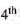
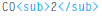

# IMAGES

## Choosing Images for Your Site

*Images* can be used to set the tone for a site in less time than it takes to read a description.

## Storing Images on Your Site

If you are building a site from scratch, it is good practice to create a folder for all of the images the site uses.

As a website grows, keeping images in a separate folder helps you understand how the site is organized.all of the images are
stored in a folder called images.

On a big site you might like to add subfolders inside the images folder. For example, images such as logos and buttons might sit in a folder called interface, product photographs might sit in a page called products, and images related to news might live in a folder called news.

## Adding Images

*< img> images*.html HTML
To add an image into the page
you need to use an < img>
element. This is an empty
element (which means there is
no closing tag). It must carry the
following two attributes:

* *src*

This tells the browser where it can find the image file. This
will usually be a relative URL pointing to an image on your
own site. (Here you can see that the images are in a child folder called images — relative.

* *alt*

This provides a text description of the image which describes the image if you cannot see it.

* *title*

You can also use the title attribute with the < img> element to provide additional information about the image.

## Height & Width of Images

You will also often see an < img>
element use two other attributes
that specify its size:

* **height**

This specifies the height of the
image in pixels.

* **width**

This specifies the width of the
image in pixels.

## Where to Place Images in Your Code

Here are three examples of image placement
that produce different results:

1. before a paragraph The paragraph starts on a new line after the image.

2. inside the start of a paragraph The first row of text aligns with the bottom of the image.

3. in the middle of a paragraph The image is placed between the
words of the paragraph that it appears in.

## Old Code: Aligning Images Horizontally

align horizontally.html HTML The align attribute was
commonly used to indicate how the other parts of a page should
flow around an image. It has been removed from HTML5
and new websites should use CSS to control the alignment of
images.

The align attribute can take these horizontal values:

* left

This aligns the image to the left
(allowing text to flow around its
right-hand side).

* right

This aligns the image to the right
(allowing text to flow around its
left-hand side).

## Old Code: Aligning Images Vertically

There are three values that the align attribute can take that
control how the image should align vertically with the text that surrounds it:

* top

This aligns the first line of the surrounding text with the top of the image.

* middle
This aligns the first line of the surrounding text with the middle of the image.

* bottom
This aligns the first line of the surrounding text with the bottom of the image.

## Three Rules for Creating Images

1. **Save images in the right format** Websites mainly use images in jpeg, gif, or png format. If you choose the wrong image format then your image might not look as sharp as it should and can make the web page slower to load.

1. **Save images at the right size** You should save the image at the same width and height it will appear on the website. If
the image is smaller than the width or height that you have
specified, the image can be distorted and stretched.

1. **Use the correct resolution** Computer screens are made up
of dots known as pixels. Images used on the web are also made
up of tiny dots. Resolution refers to the number of dots per inch, and most computer screens only show web pages at 72 pixels per inch.

## Tools to Edit & Save Images

The most popular tool amongst web professionals is Adobe Photoshop.

* *Other Software*
  * Adobe Fireworks
  * Pixelmator
  * PaintShop Pro
  * Paint.net

## Image Dimensions

* REDUCING IMAGE SIZE

You can reduce the size of images to create a smaller version of the image.**Example**: If your image is 600 pixels wide and 300 pixels tall, you can reduce the size of the image by 50%.
**Result**: This will create an image that is quicker to download.

* INCREAS ING IMAGE SIZE

You can't increase the size of photos significantly without
affecting the image quality.**Example**: If your image is only
100 pixels wide by 50 pixels tall, increasing the size by 300%
would result in poor quality.
**Result**: The image will look blurry or blocky.

* CHANGING SHAPE
Only some images can be cropped without losing valuable information.
**Example**: If your image is 300 pixels square, you can remove
parts of it, but in doing so you might lose valuable information.
**Result**: Only some images can be cropped and still make sense.

## Cropping Images

When cropping images it is important not to lose valuable information. It is best to source images that are the correct shape if possible.

## Image Resolution

Images created for the web should be saved at a resolution of 72 ppi. The higher the resolution
of the image, the larger the size of the file.

## Vector Images

Vector images differ from bitmap images and are resolution-independent. Vector images are
commonly created in programs such as Adobe Illustrator.

## Animated GIFs

Animated GIFs show several frames of an image in sequence and therefore can be used to
create simple animations.
It is important to
remember:
Each extra frame of the image increases the size of the file, and can therefore add to the time it takes for an image to download.

## Transparency

Creating an image that is partially transparent (or "see-through") for the web involves
selecting one of two formats:

1. *Transparent GIF*

If the transparent part of the image has straight edges and it is 100% transparent (that is,
not semi-opaque), you can save the image as a GIF (with the transparency option selected).

1. *PNG*

If the transparent part of the image has diagonal or rounded edges or if you want a semiopaque
transparency or a dropshadow, then you will need to save it as a PNG.

## HTML 5: Figure and Figure Caption

< figure>

Images often come with captions. HTML5 has introduced a new < figure> element to
contain images and their caption so that the two are associated.

< figcaption>

The < figcaption> element has been added to HTML5 in order to allow web page authors to add
a caption to an image.

# COLOR 

## Foreground Color

* rgb values

These express colors in terms
of how much red, green and
blue are used to make it up. For
example: rgb(100,100,90)

* hex codes

These are six-digit codes that
represent the amount of red,
green and blue in a color,
preceded by a pound or hash #
sign. For example: #ee3e80

* color names

There are 147 predefined color
names that are recognized
by browsers. For example:
DarkCyan.

## Background Color

## Contrast

## CSS 3: Opacity

* Opacity, rgba

**CSS3** introduces the *opacity*
property which allows you to
specify the opacity of an element
and any of its child elements.

The value is a number between
0.0 and 1.0 (so a value of 0.5
is 50% opacity and 0.15 is 15%
opacity).

The **CSS3** *rgba* property allows
you to specify a color, just like
you would with an RGB value,
but adds a fourth value to
indicate opacity.

* HSL COLOR

**Hue** is the colloquial idea of
color. In HSL colors, hue is often
represented as a color circle
where the angle represents the
color, although it may also be
shown as a slider with values
from 0 to 360.

**Saturation** is the amount of
gray in a color. Saturation is
represented as a percentage.
100% is full saturation and 0%
is a shade of gray.

**lightness** is the amount of
white (lightness) or black
(darkness) in a color. Lightness
is represented as a percentage.
0% lightness is black, 100%
lightness is white, and 50%
lightness is normal. Lightness
is sometimes referred to as
***luminosity***.

* HSL and HSLA

**Hue** This is expressed as an angle
(between 0 and 360 degrees).

**Saturation** This is expressed as a
percentage.

**lightness** This is expressed as a
percentage with 0% being white,
50% being normal, and 100%
being black.

**alpha** This is expressed as a
number between 0 and 1.0.
For example, 0.5 represents
50% transparency, and 0.75
represents 75% transparency.

----
# TEXT
when creating a webpage, we add tags or Markup to the content of the page. These tags provide meaning & allow browsers to show users the appropriate structure for the page.

## There is two types of markup

* Structural markup : for Heading and Paragraphs
* Semantic markup : provides extra information, such as where empasis is placed in a sentence.

## HTML has six "levels " of heading h1 to h6

* h1 is the main heading.
* h2 is the subheading.
* h3 is used if there is any sections under the subheading.
 h1 is the largest and h6 is the smallest.

 ## Paragraphs
 To create a normal paragraph we just sorround it with the < p>< /p > tags.

 ## Bold & Italic
 < b> tag is used to make the character bold.

 < i> it make the character italic.

 ## Superscript & Subscript

 < sup> it make the character superscript

 

 the result is like the image below:

 

 < sub> it used to make the character subscript

 

 the result will look like:

## Whitespace

 In order to make code easier to read, webpage Author often add extra spaces between elements. so when the browser comes across two or more spaces next to each other it only display one space.

## Line breaks & Horizontal Rules

* < br/> when using it in the end of a word it will make a new line to start the rest of the words.

 *< hr/> it is used to create breaks between themes such as when starting a new topic.

## Visual Editors & their code views

* Visual editors

often resemble word processors. although each editor will differ slightly.

* Code views

show you the code created by the visual editor so you can manually edit it.

------

# Semantic markup

There are some text elements that are not included to affect the structure of the webpage, but they add extra information to the pages.

## Strong & Emphasis

* < strong> it makes the character **bold**.

* < em> it makes the character *italic*

## Quotation

* < blockquote> is used for longer quotes that take an entire paragraph.

* < q> is used for shorter quotes that sit within a paragraph.

## Abbreviation & accronyms

< abbr> if you used an abbreviation or an accronyms then the < abbr> can be used

## Citation & difinitions

* < cite> when you are referincing a piece of work such as a book, this tag is used to indicate where the citation is from.

* < dfn> is used to indicate the defining instance of a newterm.

## Author Details

< address> element has
quite a specific use: to contain
contact details for the author of
the page.

## Changes to Content

* < ins> is used
to show content that has been
inserted into a document.
* < del> is used to show text
that has been deleted from it.

* < s> indicates
something that is no longer
accurate.

------

# Understanding CSS:

## Thinking Inside the Box

The key to understanding how *CSS* works is to imagine that there is an invisible box around every *HTML* element.

 CSS allows you to create rules that control the way that each individual box (and the contents of that box) is presented.

 CSS Associates Style rules with HTML
elements: These rules govern
how the content of specified elements should be displayed.

 A CSS rule
contains two parts: a **selector** and a **declaration**.

* Selector: indicate which
element the rule applies to.
* Declaration: indicate how
the elements referred to in the selector should be styled.

CSS Properties Affect How Elements Are Displayed.

CSS declarations sit inside curly brackets and each is made up of two
parts: a **property** and a **value**, separated by a *colon*.

* **Properties** indicate the aspects
of the element you want to
change. For example, color, font,
width, height and border.
* **Values** specify the settings
you want to use for the chosen
properties.

## Using External CSS

< link href="css/styles.css" type="text/css"
rel="stylesheet" />

## Using Internal CSS

< style type="text/css">

body {

font-family: arial;

background-color: rgb(185,179,175);}

h1 {

color: rgb(255,255,255);}

< /style>

## CSS Selectors

Selector| Meaning| Example
-------------|---------|-------
Universal Selector | Applies to all elements in the document  | * {}Targets all elements on the page
Type Selector  |Matches element names| h1, h2, h3 {}Targets the < h1>, < h2> and < h3>elements
Class Selector| Matches an element whose class attribute|.note {} Targets any element whose class attribute has a value of note p.note {} Targets only < p> elements whose class attribute has a value of note
ID Selector | Matches an element whose id attribute has a value that matches the one specified after the pound or hash symbol | #introduction {} Targets the element whose id attribute has a value of introduction
Child Selector| Matches an element that is a direct child of another| li>a {} Targets any < a> elements that are children of an < li> element (but not other < a> elements in the page)
Descendant Selector | Matches an element that is a descendent of another specified element| p a {}Targets any < a> elements that sit inside a < p> element, even if there are other elements nested between them
Adjacent Sibling Selector| Matches an element that is the next sibling of another | h1+p {}Targets the first < p> element after any < h1> element
General Sibling| Matches an element that is a sibling of another, although it does not have to be the directly preceding element Selector | h1~p {} If you had two  < p> elements that are siblings of an < h1> element, this rule would apply to both

## JPEG vs PNG vs GIF — which image format to use and when?

* TL;DR
Use JPEG format for all images that contain a natural scene or photograph where variation in colour and intensity is smooth. Use PNG format for any image that needs transparency or for images with text & objects with sharp contrast edges like logos. Use GIF format for images that contain animations.

* Compression
Almost all forms of data that we see on the internet — text, image, video etc. — are compressed to reduce the size of data and ensure faster transmission. Choosing the correct format and compression is a major factor that determines image size.

* JPEG is a lossy compression specification that takes advantage of human perception. It can achieve compression ratios of 1:10 without any perceivable difference in quality.
