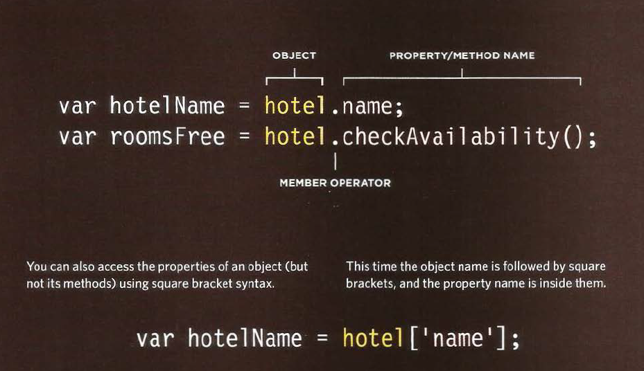

# OBJECTS

Objects group together a set of variables and functions to create a model
of a something you would recognize from the real world. In an object,
variables and functions take on new names.

## IN AN OBJECT: VARIABLES BECOME KNOWN AS **PROPERTIES**

If a variable is part of an object, it is called a
property. Properties te ll us about the object, such as
the name of a hotel or the number of rooms it has.

## IN AN OBJECT: FUNCTIONS BECOME KNOWN AS **METHODS**

If a function is part of an object, it is called a method.

## CREATING AN OBJECTS: LETERAL NOTATION

* The Object is the **curly** braces and it's content.

* Separate each key from its value with a **COLON**.
* Separate each properety and method with **COMA**.

In the checkAvailability method ,the **THIS** keyword is used to indicate that it is using the rooms and booked properities of **THIS** object.

## ACCESSING AN OBJECT AND THE DOT NOTATION

You can access properities and methods of the object by using **.**

You can also access properities using the square bracets [ ].

## DOCUMENT OBJECT MODEL

The **Document Object Model (DOM)** specifies how browsers should create a model of an HTML page and how JavaScript can access and update the contents of a web page while it is in the browser window.

## MAKING A MODEL OF THE HTML PAGE

When the browser loads a web page, it
creates a model of the page in memory.
The DOM specifies the way in which the
browser should structure this model using
a DOM tree.

## ACCESSING AND CHANGING THE HTML PAGE

The DOM also defines methods and
properties to access and update each
object in this model, which in turn updates
what the user sees in the browser.

## THE DOM TREE IS A MODEL OF A WEB PAGE

As a browser loads a web page, it creates a model of that page.
The model is called a DOM tree, and it is stored in the browsers' memory.
It consists of four main types of nodes.

* **THE DOCUMENT NODE**

Above, you can see the HTML code for a shopping list, and on the right hand page is its DOM tree.
Every element, attribute, and piece of text in the HTML is represented by its own DOM node.
At the top of the tree a document node is added; it represents the entire page.

* **ELEMENT NODES**

HTML elements describe the structure of an HTML page. (The < h l > - < h6> elements describe what
parts are headings; the < p> tags indicate where paragraphs of text start and finish; and so on.)
To access the DOM tree, you start by looking for elements. Once you find the element you want, then you can access its text and attribute nodes if you want to.

* **ATTRIBUTE NODE**

The opening tags of HTML elements can carry attributes and these are represented by attribute
nodes in the DOM tree. Attribute nodes are not children of the element thar carries them; they are part of that element. Once you access an element, there are specific JavaScript
methods and properties to read or change that element's attributes.

* **TEXT NODES**
Once you have accessed an element node, you can then reach the text within that element. This is
stored in its own text node. Text nodes cannot have children. If an element contains text and another child element, the child element is not a child of the text node but rather a child of the containing element.

## WORKING WITH THE DOM TREE

Accessing and updating the DOM tree involves two steps:

1. Locate the node that represents the element you want to work with.

2. Use its text content, child elements, and attributes.

 1st :  Accessing the ELEMENTS:

* SELECT AN INDIVIDUAL ELEMENT NODE

  * get Element Byld ( ) Uses the value of an element's id attribute.
  * querySelector ( )Uses a CSS selector, and returns the first matching element.

* SELECT MULTIPLE ELEMENTS (NODELISTS)

  * getElementsByClassName( ) Selects all elements that have a specific value for their class attribute.
  
  * getElementsByTagName( ) Selects all elements that have the specified tag name.

  * querySelectorAll( ) Uses a CSS selector to select all matching elements.

* TRAVERSING BETWEEN ELEMENT NODES
  * parentNode Selects the parent of the current element node (which will return just one element).

  * previousSibling / nextSibling Selects the previous or next sibling from the DOM tree.

  * firstChild / lastChild Select the first or last child of the current element.

2nd : WORK WITH THOSE ELEMENTS

* ACCESS/ UPDATE TEXT NODES
The text inside any element is
stored inside a text node. To
access the text node above:

1. Select the < li >element
2. Use the fi rstChi l d property
to get the text node
3. Use the text node's only
property (nodeValue) to get
the text from the element.

* WORK WITH HTML CONTENT

One property allows access to child elements and text content:
**innerHTML**

Another just the text content: .
**textContent**

Several methods let you create new nodes, add nodes to a tree, and remove nodes from a tree:
**create Element( )**.

**createTextNode( )**.

**appendChild ( ) / removeChild ( )**.

This is called DOM manipulation.

* ACCESS OR UPDATE ATTRIBUTE VALUES

Here are some of the properties and methods you can use to work with attributes:

**className /id**.

Lets you get or update the value
of the cl ass and id attributes.

**hasAttribute( )**.

**getAttribute( )**.

**setAttribute( )**.

**removeAttribute( )**.

The first checks if an attribute exists. The second gets its value. The third updates the value. The fourth removes an attribute.

* ACCESSING ELEMENTS

DOM queries may return one element, or they may return a Nodelist, which is a
collection of nodes.
