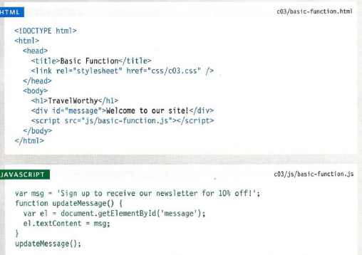
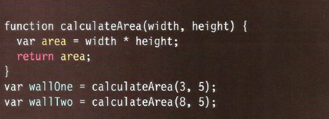
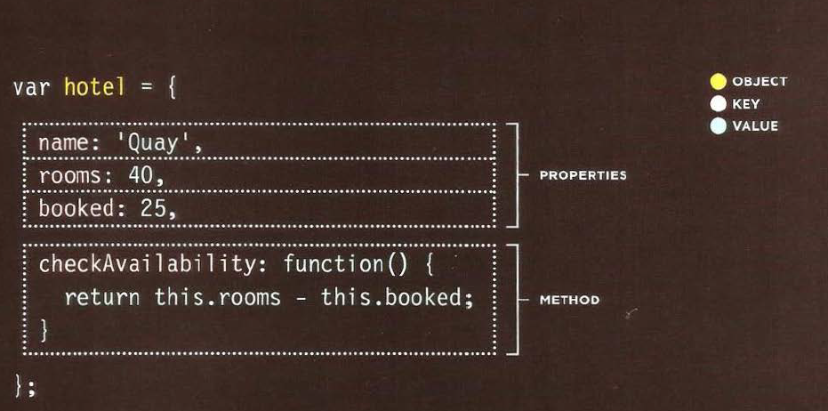
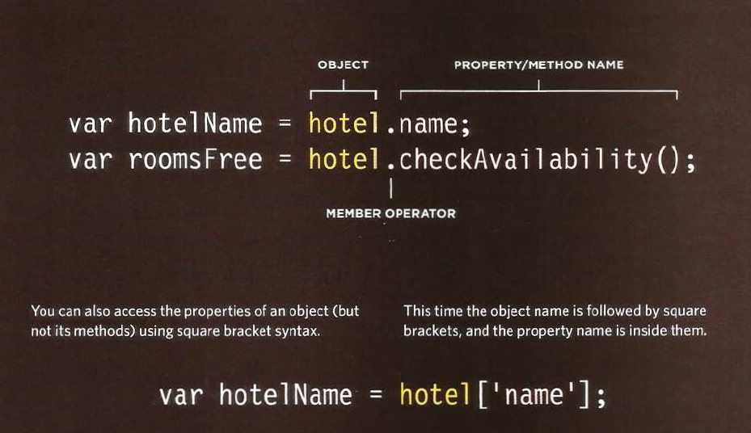
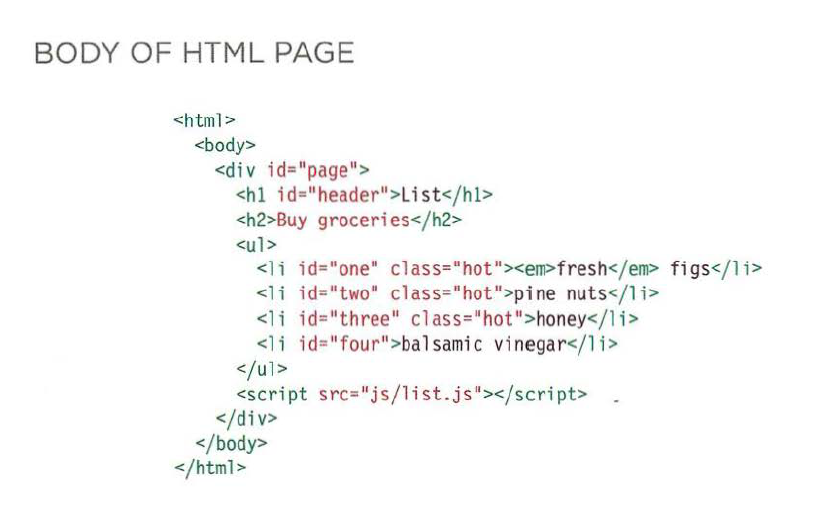

# TABLES

## Basic Table Structure

* < table>

The < table> element is used to create a table. The contents of the table are written out row by row.

* < tr>

You indicate the start of each row using the opening < tr> tag. (The tr stands for table row.)
It is followed by one or more < td> elements (one for each cell in that row).
At the end of the row you use a closing < /tr> tag.

* < td>

Each cell of a table is represented using a < td> element. (The td stands for
table data.)

## Table Headings

< th>
The < th> element is used just like the < td> element but its purpose is to represent the heading for either a column or a row.

## Spanning Columns

Sometimes you may need the entries in a table to stretch across more than one column.
The colspan attribute can be used on a < th> or < td> element and indicates how many columns
that cell should run across.

## Spanning Rows

You may also need entries in a table to stretch down across more than one row.
The rowspan attribute can be used on a < th> or < td> element to indicate how many rows a cell
should span down the table.

## Long Tables

* < thead>

The headings of the table should sit inside the < thead> element.

* < tbody>

The body should sit inside the < tbody> element.

* < tfoot>

The footer belongs inside the < tfoot> element.

## Old Code: Width & Spacing

There are some outdated attributes which you should not use on new websites. You may,
however, come across some of them when looking at older code, so I will mention them
here. All of these attributes have been replaced by the use of CSS. The width attribute was used
on the opening < table> tag to indicate how wide that table should be and on some opening
< th> and < td> tags to specify the width of individual cells. The value of this attribute is
the width of the table or cell in pixels. The columns in a table need to form a straight line, so you often only see the width attribute on the first row (and all subsequent rows would use that setting).

## Old Code: Border & Background

The border attribute was used on both the < table> and < td> elements to indicate the width of
the border in pixels. The bgcolor attribute was used to indicate background colors
of either the entire table or individual table cells. The value is usually a hex code.

**Function** 
* let you group a series of statements together to perform a specific task. Also it is used if you want to reuse the same statements more than one time.

* Grouping together the statements that are required to perform a specific task also helps organize your code.
* The statements or steps the function needs to perform are packaged in a *code block*.
* Further, the statements in a *function* are *NOT* always executed  when a page loads, also offers you to store the steps needed to do a task.
* Some *functions* needs to be provided with information in order to achieve a task.
* Information that are passed to a *function* known as **Parameters**.
* The responses of a function are called **Return Value**.

# A Basic Function

Here in this Example the user is shown a message it is held in an HTML element and going to be changed using JavaScript.

we link the HTML with JS in the HTML body we write 
< script src="the path"> < /script >

# Declaring a function
To create a function you give it a name and then write the statements needed to be done inside the curly braces.

To call a function we only write **the name of the function**.
 
 # Declaring a function that need *Information*
 We write a normal function the write inside it the **Parameters**  that needed.

To call a function that need information we give every **Parameter** information, then we call the function including its **Parameters**.

To get a **single value** out of a function.

# OBJECTS

Objects group together a set of variables and functions to create a model
of a something you would recognize from the real world. In an object,
variables and functions take on new names.

## IN AN OBJECT: VARIABLES BECOME KNOWN AS **PROPERTIES**

If a variable is part of an object, it is called a
property. Properties te ll us about the object, such as
the name of a hotel or the number of rooms it has.

## IN AN OBJECT: FUNCTIONS BECOME KNOWN AS **METHODS**

If a function is part of an object, it is called a method.

## CREATING AN OBJECTS: LETERAL NOTATION

* The Object is the **curly** braces and it's content.

* Separate each key from its value with a **COLON**.
* Separate each properety and method with **COMA**.

In the checkAvailability method ,the **THIS** keyword is used to indicate that it is using the rooms and booked properities of **THIS** object.

## ACCESSING AN OBJECT AND THE DOT NOTATION

You can access properities and methods of the object by using **.**

You can also access properities using the square bracets [ ].

## DOCUMENT OBJECT MODEL

The **Document Object Model (DOM)** specifies how browsers should create a model of an HTML page and how JavaScript can access and update the contents of a web page while it is in the browser window.

## MAKING A MODEL OF THE HTML PAGE

When the browser loads a web page, it
creates a model of the page in memory.
The DOM specifies the way in which the
browser should structure this model using
a DOM tree.

## ACCESSING AND CHANGING THE HTML PAGE

The DOM also defines methods and
properties to access and update each
object in this model, which in turn updates
what the user sees in the browser.

## THE DOM TREE IS A MODEL OF A WEB PAGE

As a browser loads a web page, it creates a model of that page.
The model is called a DOM tree, and it is stored in the browsers' memory.
It consists of four main types of nodes.

* **THE DOCUMENT NODE**

Above, you can see the HTML code for a shopping list, and on the right hand page is its DOM tree.
Every element, attribute, and piece of text in the HTML is represented by its own DOM node.
At the top of the tree a document node is added; it represents the entire page.

* **ELEMENT NODES**

HTML elements describe the structure of an HTML page. (The < h l > - < h6> elements describe what
parts are headings; the < p> tags indicate where paragraphs of text start and finish; and so on.)
To access the DOM tree, you start by looking for elements. Once you find the element you want, then you can access its text and attribute nodes if you want to.

* **ATTRIBUTE NODE**

The opening tags of HTML elements can carry attributes and these are represented by attribute
nodes in the DOM tree. Attribute nodes are not children of the element thar carries them; they are part of that element. Once you access an element, there are specific JavaScript
methods and properties to read or change that element's attributes.

* **TEXT NODES**
Once you have accessed an element node, you can then reach the text within that element. This is
stored in its own text node. Text nodes cannot have children. If an element contains text and another child element, the child element is not a child of the text node but rather a child of the containing element.

## WORKING WITH THE DOM TREE

Accessing and updating the DOM tree involves two steps:

1. Locate the node that represents the element you want to work with.

2. Use its text content, child elements, and attributes.

 1st :  Accessing the ELEMENTS:

* SELECT AN INDIVIDUAL ELEMENT NODE

  * get Element Byld ( ) Uses the value of an element's id attribute.
  * querySelector ( )Uses a CSS selector, and returns the first matching element.

* SELECT MULTIPLE ELEMENTS (NODELISTS)

  * getElementsByClassName( ) Selects all elements that have a specific value for their class attribute.
  
  * getElementsByTagName( ) Selects all elements that have the specified tag name.

  * querySelectorAll( ) Uses a CSS selector to select all matching elements.

* TRAVERSING BETWEEN ELEMENT NODES
  * parentNode Selects the parent of the current element node (which will return just one element).

  * previousSibling / nextSibling Selects the previous or next sibling from the DOM tree.

  * firstChild / lastChild Select the first or last child of the current element.

2nd : WORK WITH THOSE ELEMENTS

* ACCESS/ UPDATE TEXT NODES
The text inside any element is
stored inside a text node. To
access the text node above:

1. Select the < li >element
2. Use the fi rstChi l d property
to get the text node
3. Use the text node's only
property (nodeValue) to get
the text from the element.

* WORK WITH HTML CONTENT

One property allows access to child elements and text content:
**innerHTML**

Another just the text content: .
**textContent**

Several methods let you create new nodes, add nodes to a tree, and remove nodes from a tree:
**create Element( )**.

**createTextNode( )**.

**appendChild ( ) / removeChild ( )**.

This is called DOM manipulation.

* ACCESS OR UPDATE ATTRIBUTE VALUES

Here are some of the properties and methods you can use to work with attributes:

**className /id**.

Lets you get or update the value
of the cl ass and id attributes.

**hasAttribute( )**.

**getAttribute( )**.

**setAttribute( )**.

**removeAttribute( )**.

The first checks if an attribute exists. The second gets its value. The third updates the value. The fourth removes an attribute.

## ACCESSING ELEMENTS

DOM queries may return one element, or they may return a Nodelist, which is a
collection of nodes.

* GROUPS OF ELEMENT NODES

If a method can return more than one node, it will always return a **Nodelist**, which is a collection of **nodes** (even if it only finds one matching element). You then need to select the element you want from this list using an index number (which means the numbering starts at 0 like the items in an array).

* FASTEST ROUTE

Finding the quickest way to access an element within your web page will make the page seem
faster and/or more responsive. This usually means evaluating the minimum number of nodes on the
way to the element you want to work with. For example, getEl ementByld () will quickly return one
element (because no two elements on the same page should have the same value for an id attribute).

* getElementsByClassName( 1class 1)

Selects one or more elements given the va lue of their cl ass attribute.
The HTML must have a cl ass attribu te for it to be selectable.

* getElementsByTagName( 1 tagName 1)

Selects all elements on the page with the specified tag name.

## NODELISTS: DOM QUERIES THAT RETURN MORE THAN ONE ELEMENT

When a DOM method can return more than one element, it returns a
**Nodelist**.

Nodelists look like arrays and are numbered like arrays, but they are not ac tually arrays; they are a type of object called a collection.

## LIVE & STATIC NODELISTS

a **live Nodelist**, when your script updates the page, the Nodelist is updated at the same time.
The methods beginning getEl ementsBy_ return live Node lists. They are also typically faster to generate than static Nodelists.

In a **static Nodelist** when your script updates the page, the NodeList is not updated to reflect the changes made by the script.

## SELECTING ELEMENTS USING CLASS ATTRIBUTES

The get El ementsByCl ass Name() method allows you to select elements whose c 1 ass attribute contains a specific value.
The method has one parameter:
the class name which is given in quotes within the parentheses after the method name.

## SELECTING ELEMENTS BY TAG NAME

The get ElementsByTagName () method allows you to select elements using their tag name. The element name is specified
as a parameter, so it is placed inside the parentheses and is contained by quote marks.

## SELECTING ELEMENTS USING CSS SELECTORS

querySelector() returns the first element node that matches the CSS-style selector. querySe 1ectorA11 () returns a
Nodelist of all of the matches.
Both methods take a CSS
selector as their only parameter. The CSS selector syntax offers more flexibility and accuracy when selecting an element than just specifying a class name or a tag name, and should also be familiar to front-end web developers who are used to targeting elements using CSS.

## TRAVERSING THE DOM

* parentNode

This property finds the elementnode for the containing.

* previousSibling nextSibling

These properties find the previous or next sibling of a node if there are siblings.

* firstChild lastChild

These properties find the first or last child of the current element.

## WHITESPACE NODES

Traversing the DOM can be difficult because some browsers add a text node whenever they
come across whitespace between elements.

## ACCESS & UPDATE A TEXT NODE WITH NODEVALUE

When you select a text node, you can retrieve or amend the content of it
using the node Value property.
