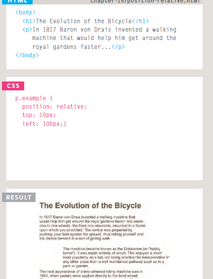
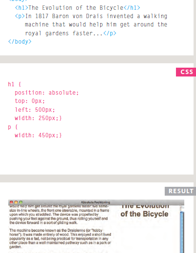
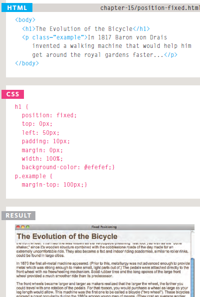
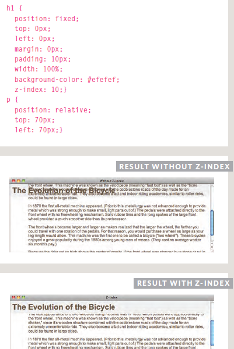
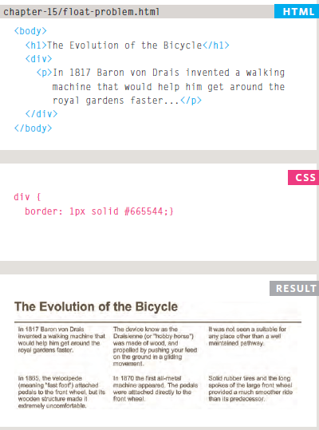

# LAYOUT

## Key Concepts in Positioning Elements

Building Blocks CSS treats each HTML element as if it is in its own box. This box will either be a block-level box or an inline box.

* *Block-level elements*

start on a new line
Examples include:
< h1> < p> < ul> < li>.

* *Inline elements*

flow in between
surrounding text
Examples include:
< img> < b> < i>.

## Controlling the Position of Elements

* *Normal flow*

Every block-level element appears on a new line, causing each item to appear lower down the page than the previous one. Even if you specify the width of the boxes and there is space for two elements to sit side-byside, they will not appear next to each other. This is the default
behavior (unless you tell the browser to do something else).

* *Relative Positioning*

This moves an element from the position it would be in normal flow, shifting it to the top,right,
bottom, or left of where it would have been placed. This does not affect the position of surrounding elements; they stay in the position they would be in normal flow.

## To indicate where a box should be positioned

* *Fixed Positioning*

This is a form of absolute positioning that positions the element in relation to the browser window, as opposed to the containing element.

* *Floating Elements*

Floating an element allows you to take that element out of normal flow and position it to the far left or right of a containing box.

## Normal Flow  (position:static)

In normal flow, each block-level element sits on top of the next one. Since this is the default way in which browsers treat HTML elements, you do not need a CSS property to indicate that elements should appear in normal flow, but the syntax
would be:

**position: static;**

I have not specified a width property for the heading element, so you can see how it
stretches the width of the entire browser window by default.

## Relative Positioning (position:relative)

Relative positioning moves an element in relation to where it would have been in normal flow.
*For example*, you can move it 10 pixels lower than it would have been in normal flow or 20% to
the right.

You can indicate that an element should be relatively positioned using the position property
with a value of relative.

You then use the offset properties (top or bottom and left or right) to indicate how
far to move the element from where it would have been in normal flow.

## Absolute Positioning (position:absolute)

When the position property is given a value of absolute, the box is taken out of normal
flow and no longer affects the position of other elements on the page. (They act like it is not
there.)

The box offset properties (top or bottom and left or right) specify where the element
should appear in relation to its containing element.

In this example, the heading has been positioned at the top of the page and 500 pixels from its left edge. The width of the heading is set to be 250 pixels wide.

## Fixed Positioning(position:fixed)

Fixed positioning is a type of absolute positioning that requires the position property
to have a value of fixed.

It positions the element in relation to the browser window. Therefore, when a user scrolls
down the page, it stays in the exact same place. It is a good idea to try this example in your
browser to see the effect. To control where the fixed position box appears in relation
to the browser window, the box offset properties are used.

In this example, the heading has been positioned to the top left hand corner of the browser
window. When the user scrolls down the page, the paragraphs disappear behind the heading.
The < p> elements are in normal flow and ignore the space that the < h1> element would have taken up. Therefore, the margin-top property has been used to push the first < p>
element below where the fixed position < h1> element is sitting.

## Overlapping Elements(z-index)

When you use relative, fixed, or absolute positioning, boxes can overlap. If boxes do overlap, the elements that appear later in the HTML code sit on top of those that are earlier in the page.
If you want to control which element sits on top, you can use the z-index property. Its value
is a number, and the higher the number the closer that element is to the front.

 For example, an element with a z-index of 10 will appear over the top of one with a z-index of 5.
 but it uses relative positioning for the  < p> elements. Because the paragraphs are relatively positioned, by default they would appear over the top of the heading as the user scrolls down
the page. To ensure that the < h1> element stays on top, we use the z-index property on the
rule for the < h1> element.

## Floating Elements (float)

The float property allows you to take an element in normal flow and place it as far to the
left or right of the containing element as possible. Anything else that sits inside the containing element will flow around the element that is floated.

## Using Float to Place Elements Side-by-Side

A lot of layouts place boxes next to each other. The float property is commonly used to
achieve this. When elements are floated, the height of the boxes can affect where the following elements sit.

## Clearing Floats (clear)

The clear property allows you to say that no element (within the same containing element)
should touch the left or righthand sides of a box. It can take the following values:

**left**
The left-hand side of the box should not touch any other elements appearing in the same
containing element. (clear:left)

**right**
The right-hand side of the box will not touch elements appearing in the same containing
element.(clear:right)

**both**
Neither the left nor right-hand sides of the box will touch elements appearing in the same
containing element.

**none**
Elements can touch either side.

## Parents of Floated Elements: Problem

If a containing element only contains floated elements, some browsers will treat it as if it is
zero pixels tall. As you can see in this example, the one pixel border assigned to the containing element has collapsed, so the box looks like a two pixel line.

## Parents of Floated Elements: Solution

Traditionally, developers got around this problem by adding an extra element after the
last floated box (inside the containing element). A CSS rule would be applied to this
additional element setting the clear property to have a value of both. But this meant that an
extra element was added to the HTML just to fix the height of the containing element.

More recently, developers have opted for a purely CSS-based solution because it means that
there is no need to add an extra element to the HTML page after the floated elements. The pure
CSS solution adds two CSS rules to the containing element (in this
example the < div> element):

* The overflow property is given a value auto.
* The width property is set to 100%.

## Creating Multi-Column Layouts with Floats

The following three CSS properties are used to position
the columns next to each other:

* **width**

This sets the width of the
columns.

* **float**

This positions the columns next
to each other.

* **margin**

This creates a gap between the
columns.

## Fixed Width Layouts

Fixed width layout designs do not change size as the user increases or decreases the size of their browser window. Measurements tend to be given in pixels.

**Advantages**

* Pixel values are accurate at controlling size and positioning of elements.
* The designer has far greater control over the appearance and position of items on the
page than with liquid layouts.
* You can control the lengths of lines of text regardless of the size of the user's window.
* The size of an image will always remain the same relative to the rest of the page.

**Disadvantages**

* You can end up with big gaps around the edge of a page.
* If the user's screen is a much higher resolution than the designer's screen, the page
can look smaller and text can be harder to read.
* If a user increases font sizes, text might not fit into the allotted spaces.
* The design works best on devices that have a site or resolution similar to that of
desktop or laptop computers.
* The page will often take up more vertical space than a liquid layout with the same
content.

## Liquid Layouts

**Advantages**

* Pages expand to fill the entire browser window so there are no spaces around the page
on a large screen.
* If the user has a small window, the page can contract to fit it without the
user having to scroll to the side.
* The design is tolerant of users setting font sizes larger than the designer intended
(because the page can stretch).

**Disadvantages**

* If you do not control the width of sections of the page then the design can look very
different than you intended, with unexpected gaps around certain elements or items
squashed together.
* If the user has a wide window, lines of text can become very long, which makes them harder to read.
* If the user has a very narrow window, words may be squashed and you can end up with few words on each line.
* If a fixed width item (such as an image) is in a box that is too small to hold it (because
the user has made the window smaller) the image can overflow over the text.

