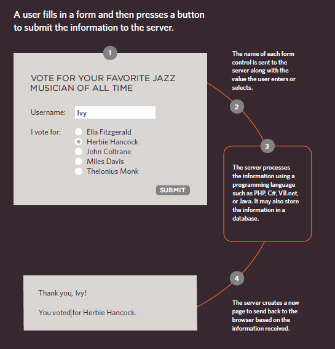
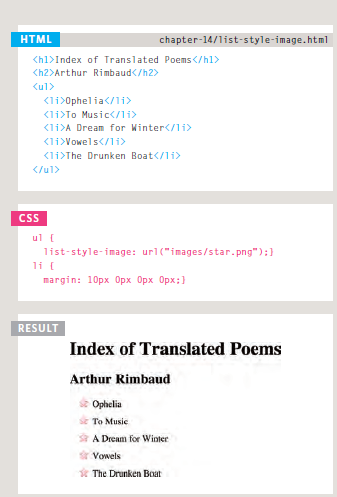
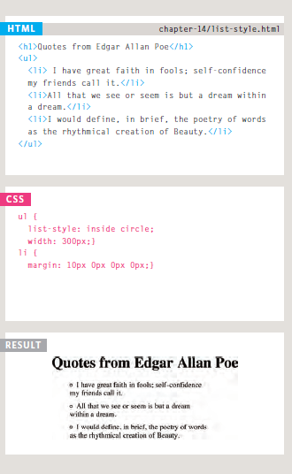

# FORMS

The best known form on the web is probably
the search box that sits right in the middle of
Google's homepage.

## Form Controls

**ADDING TEXT**

* **Text input (single-line)**
Used for a single line of text such
as email addresses and names.

* **Password input**:Like a single line text box but it
masks the characters entered.

* **Text area (multi-line)**: For longer areas of text, such as
messages and comments.

**Making Choices:**

* **Radio buttons**
For use when a user must select
one of a number of options.

* **Checkboxes**
When a user can select and
unselect one or more options.

* **Drop-down boxes**
When a user must pick one of a
number of options from a list.

**Submitting Forms:**

* **Submit buttons**
To submit data from your form
to another web page.

* **Image buttons**
Similar to submit buttons but
they allow you to use an image.

**Uploading Files:**

* **File upload**
Allows users to upload files
(e.g. images) to a website.

## How Forms Work

A form may have several form controls, each gathering different information. The server
needs to know which piece of inputted data corresponds with which form element.

## Form Structure

* < form>
Form controls live inside a < form> element. This element should always carry the action
attribute and will usually have a method and id attribute too.
* action
 Every < form> element requires an action attribute. Its value is the URL for the page on the server that will receive the information in the form when it is submitted.
* method
 Forms can be sent using one of two methods: **get or post.**

With the **get method**, the values from the form are added to the end of the URL specified in
the action attribute.
The get method is ideal for:

* short forms (such as search boxes).
* when you are just retrieving data from the web server (not sending information that
should be added to or deleted from a database).

With the **post method** the values are sent in what are known as HTTP headers. As a
rule of thumb you should use the post method if your form:

* allows users to upload a file
* is very long
* contains sensitive data (e.g. passwords)
* adds information to, or deletes information from, a database.

## TEXT INBOX

* < input>
The < input> element is used to create several different form controls. The value of the type
attribute determines what kind of input they will be creating.

* type="text"

When the type attribute has a value of text, it creates a singleline text input.

* name

When users enter information into a form, the server needs to know which form control each
piece of data was entered into.

* The size attribute

should not be used on new forms. It was used in older forms to indicate the width of the text input (measured by the number of characters that would be seen).

* maxlength

You can use the maxlength attribute to limit the number of characters a user may enter
into the text field. Its value is the number of characters they may enter. For example, if you were asking for a year, the maxlength attribute could have a value of 4.

## Password Input

* < input>
type="password"
When the type attribute has a value of password it creates a text box that acts just like a
single-line text input, except the characters are blocked out. They are hidden in this way so
that if someone is looking over the user's shoulder, they cannot see sensitive data such as
passwords.

* name

The name attribute indicates the name of the password input, which is sent to the server with
the password the user enters. size, maxlength It can also carry the size and maxlength attributes like the the single-line text input.

## TEXT AREA

< textarea>
The < textarea> element is used to create a mutli-line text input. Unlike other input
elements this is not an empty element. It should therefore have an opening and a closing tag.
Any text that appears between the opening < textarea> and closing < /textarea> tags will
appear in the text box when the page loads. If the user does not delete any text between these tags, this message will get sent to the server along with whatever the user has typed.

## Radio Button

* < input>
type="radio"
Radio buttons allow users to pick just one of a number of options.

* name
The name attribute is sent to the server with the value of the option the user selects. When
a question provides users with options for answers in the form of radio buttons, the value of
the name attribute should be the same for all of the radio buttons used to answer that question.

* value
The value attribute indicates the value that is sent to the server for the selected option.
The value of each of the buttons in a group should be different (so that the server knows which
option the user has selected).

* checked
The checked attribute can be used to indicate which value (if any) should be selected when
the page loads. The value of this attribute is checked. Only one radio button in a group should
use this attribute.

## CHECKBOX

* < input>
type="checkbox"
Checkboxes allow users to select (and unselect) one or more options in answer to a question.

* name
The name attribute is sent to the server with the value of the option(s) the user selects. When
a question provides users with options for answers in the form of checkboxes, the value of the
name attribute should be the same for all of the buttons that answer that question.

* value
The value attribute indicates the value sent to the server if this checkbox is checked.

* checked
The checked attribute indicates that this box should be checked when the page loads. If used, its
value should be checked.

## Drop Down List Box

* < select>
A drop down list box (also known as a select box) allows users to select one option from a
drop down list. The < select> element is used to create a drop down list box. It
contains two or more < option> elements.

* name
The name attribute indicates the name of the form control being sent to the server, along with the value the user selected.

* < option>
The < option> element is used to specify the options that the user can select from. The words
between the opening < option> and closing < /option> tags will be shown to the user in the drop
down box.

* value
The < option> element uses the value attribute to indicate the value that is sent to the server
along with the name of the control if this option is selected.

* selected
The selected attribute can be used to indicate the option that should be selected when the
page loads. The value of this attribute should be selected.

## Multiple Select Box

* < select>
size
You can turn a drop down select box into a box that shows more than one option by adding the
size attribute. Its value should be the number of options you want to show at once. In the
example you can see that three of the four options are shown. Unfortunately, the way that
browsers have implemented this attribute is not perfect, and it should be tested throroughly if
used (in particular in Firefox and Safari on a Mac).

* multiple
You can allow users to select multiple options from this list by adding the multiple attribute
with a value of multiple.

## File Input Box

* < input>
If you want to allow users to upload a file (for example an image, video, mp3, or a PDF),
you will need to use a file input box.

* type="file"
This type of input creates a box that looks like a text input followed by a browse button.
When the user clicks on the browse button, a window opens up that allows them to select a
file from their computer to be uploaded to the website.

## Submit Button

* < input>
type="submit"
The submit button is used to send a form to the server.

* name
It can use a name attribute but it does not need to have one.

* value
The value attribute is used to control the text that appears on a button. It is a good idea to
specify the words you want to appear on a button because the default value of buttons on some
browsers is ‘Submit query’ and this might not be appropriate for all kinds of form.

## Image Button

* < input>
type="image"
If you want to use an image for the submit button, you can give the type attribute a value of
image.

## Button & hidden Controls

* < button>
The < button> element was introduced to allow users more control over how their buttons
appear, and to allow other elements to appear inside the button.
This means that you can combine text and images between the opening < button>
tag and closing < /button> tag.
* < input>
type="hidden"
This example also shows a hidden form control. These form controls are not shown on the
page (although you can see them if you use the View Source option in the browser). They allow web
page authors to add values to forms that users cannot see.

## Labelling Form Controls

* < label>
When introducing form controls, the code was kept simple by indicating the purpose of each
one in text next to it. However, each form control should have its own < label> element as this
makes the form accessible to vision-impaired users. The < label> element can be
used in two ways. It can:

1. Wrap around both the text description and the form input (as shown on the first line of the
example to your right).
2. Be kept separate from the form control and use the for attribute to indicate which form
control it is a label for (as shown with the radio buttons).

* for
The for attribute states which form control the label belongs to. Note how the radio buttons use
the id attribute. The value of the id attribute uniquely identifies an element from all other elements on page.

## Grouping Form Elements

* < fieldset>
You can group related form controls together inside the < fieldset> element. This is
particularly helpful for longer forms.
Most browsers will show the fieldset with a line around the edge to show how they are
related. The appearance of these lines can be adjusted using CSS.

* < legend>
The < legend> element can come directly after the opening < fieldset> tag and contains a
caption which helps identify the purpose of that group of form controls.

# LIST, TABLES & FORMS

## Bullet Point Styles(list-style-type)

* Unordered Lists
For an unordered list you can use
the following values:
none
disc
circle
square

* Ordered Lists
For an ordered (numbered) list
you can use the following values:
decimal
1 2 3
decimal-leading-zero
01 02 03
lower-alpha
a b c
upper-alpha
A B C
lower-roman
i. ii. iii.
upper-roman
I II III

## Images for Bullets(list-style-image)

## Positioning the Marker(list-style-position)

This property can take one of
two values:

* outside
The marker sits to the left of the block of text. (This is the default
behaviour if this property is not used.)

* inside
The marker sits inside the box of text (which is indented).

## List Shorthand(list-style)

## Table Properties

**width** to set the width of the table

**padding** to set the space
between the border of each table
cell and its content

**text-transform** to convert the
content of the table headers to uppercase

**letter-spacing**, **font-size**
to add additional styling to the
content of the table headers

**border-top, border-bottom**
to set borders above and below
the table headers

**text-align** to align the writing
to the left of some table cells and
to the right of the others

**background-color**to change
the background color of the
alternating table rows

**:hover** to highlight a table row
when a user's mouse goes over it

## Border on Empty Cells(empty-cells)

*show*
This shows the borders of any empty cells.

*hide*
This hides the borders of any empty cells.

*inherit*
If you have one table nested
inside another, the inherit
value instructs the table cells to
obey the rules of the containing
table.

## Gaps Between Cells(border-spacing, border-collapse)

* collapse
Borders are collapsed into a
single border where possible.
(border-spacing will be
ignored and cells pushed
together, and empty-cells
properties will be ignored.)

* separate
Borders are detached from each
other. (border-spacing and
empty-cells will be obeyed.)

## Styling Text Inputs

*font-size* sets the size of the text entered by the user.

*color* sets the text color, and
*background-color* sets the
background color of the input.

*border* adds a border around
the edge of the input box, and
*border-radius* can be used
to create rounded corners (for
browsers that support this
property).

The :**focus pseudo-class** is
used to change the background
color of the text input when it
is being used, and the **:hover
psuedo-class** applies the same
styles when the user hovers over
them.

**background-image** adds a
background image to the box.
Because there is a different
image for each input, we are
using an attribute selector
looking for the value of the id
attribute on each input.

## Styling Submit Buttons

*color* is used to change the
color of the text on the button.

*text-shadow* can give a 3D
look to the text in browsers that
support this property.

*border-bottom* has been used
to make the bottom border of
the button slightly thicker, which
gives it a more 3D feel.

*background-color* can make
the submit button stand out
from other items around it.
(Creating a consistent style
for all buttons helps users
understand how they should
interact with the site.) A gradient
background has been added for
browsers that support gradients.

The **:hover pseudo-class**
has been used to change the
appearance of the button when
the user hovers over it.

## Styling Fieldsets & Legends

*width* is used to control
the width of the fieldset. In
this example, the width of
the fieldset forces the form
elements to wrap onto a new line
in the correct place. (If it were
wider, the items might sit on one
line.)

*color* is used to control the
color of text.

*background-color* is used to
change the color behind these
items.

*border* is used to control the
appearance of the border around
the fieldset and/or legend.
*border-radius* is used to
soften the edges of these
elements in browsers that
support this property.

*padding* can be used to add
space inside these elements.

# EVENTS

## DIFFERENT EVENT TYPES

## HOW EVENTS TRIGGER JAVASCRIPT CODE

1. Select the element
node(s) you want the
script to respond to.
For example, if you want to
trigger a function when a user
clicks on a specific link, you need
to get the DOM node for that
link element.

2. Indicate which event on
the selected node(s) will
trigger the response.
Programmers call this binding an
event to a DOM node.

3. State the code you want
to run when the event
occurs.
When the event occurs, on a
specified element, it will trigger
a function. This may be a named
or an anonymous function.

## THREE WAYS TO BIND AN EVENT TO AN ELEMENT

1. HTML EVENT HANDLERS

2. TRADITIONAL DOM EVENT HANDLERS

3. DOM LEVEL 2 EVENT LISTENERS

## HTML EVENT HANDLER ATTRIBUTES (DO NOT USE)

Please note: This approach is
now considered bad practice;
however, you need to be aware
of it because you may see it if
you are looking at older code.
(See previous page.)

In the HTML, the first < input>
element has an attribute ca lled
onb l ur (triggered when the user
leaves the element). The value of
the attribute is the name of the
function that it should trigger.

The value of the event handler
attributes would be JavaScript.
Often it would call a function
that was written either in the
< head> element or a separate
JavaScript file.

## TRADITIONAL DOM EVENT HANDLERS

All modern browsers understand this way of creating an event handler,
but you can only attach one function to each event handler.

## USING DOM EVENT HANDLERS

In this example, the event
handler appears on the last line
of the JavaScript. Before the
DOM event handler, two things
are put in place:

1. If you use a named function
when the event fires on your
chosen DOM node, write that
function first. (You could also
use an anonymous function.)

2. The DOM element node is
stored in a variable. Here the text
input (whose id attribute has a
va lue of username) is placed into
a variable called e 1 Username.

## EVENT LISTENERS

Event listeners are a more recent approach to handling events.
They can deal with more than one function at a time
but they are not supported in older browsers.

## USING EVENT LISTENERS

In this example, the event
listener appears on the last
line of the JavaScript. Before
you write an event listener, two
things are put in place:

1. If you use a named function
when the event fi res on your
chosen DOM node, write that
function first. (You could also
use an anonymous function.)

2. The DOM element node(s) is
stored in a variable. Here the text
input (whose id attribute has a
value of username) is placed into
a variable called el Username.

## THE EVENT OBJECT

When an event occurs, the event object tells
you information about the event, and the
element it happened upon.
Every time an event fires, the The event object is passed to
event object contains helpful any function that is the event
data about the event, such as: handler or listener.

* Which element the event
happened on If you need to pass arguments
* Which key was pressed for a to a named function, the event
keypress event object will first be passed to the
* What part of the viewport the anonymous wrapper function
user clicked for a c 1 i ck event (this happens automatically);

When the event object is
passed into a function, it is often
given the parameter name e
(for event). It is a widely used
shorthand (and you see it
adopted throughout this book).
Note, however, that some
programmers also use the
parameter name e to refer to the
error object; so e may mean
event or error in some script.
