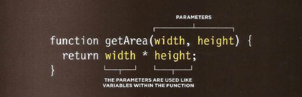

# What is Function

**Function** 
* let you group a series of statements together to perform a specific task. Also it is used if you want to reuse the same statements more than one time.

* Grouping together the statements that are required to perform a specific task also helps organize your code.
* The statements or steps the function needs to perform are packaged in a *code block*.
* Further, the statements in a *function* are *NOT* always executed  when a page loads, also offers you to store the steps needed to do a task.
* Some *functions* needs to be provided with information in order to achieve a task.
* Information that are passed to a *function* known as **Parameters**.
* The responses of a function are called **Return Value**.

# A Basic Function

Here in this Example the user is shown a message it is held in an HTML element and going to be changed using JavaScript.

we link the HTML with JS in the HTML body we write 
< script src="the path"> < /script >

# Declaring a function
To create a function you give it a name and then write the statements needed to be done inside the curly braces.

To call a function we only write **the name of the function**.
 
 # Declaring a function that need *Information*
 We write a normal function the write inside it the **Parameters**  that needed.

To call a function that need information we give every **Parameter** information, then we call the function including its **Parameters**.

To get a **single value** out of a function.
